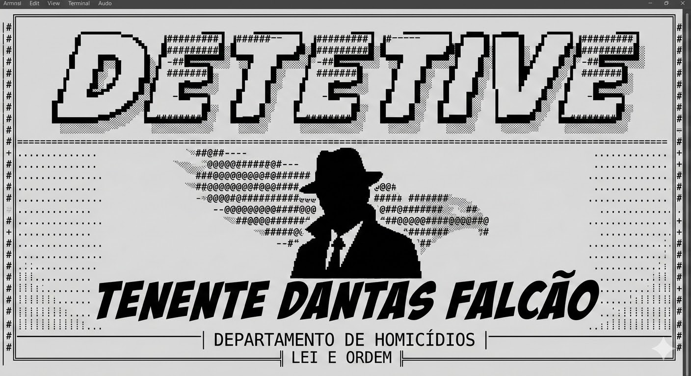
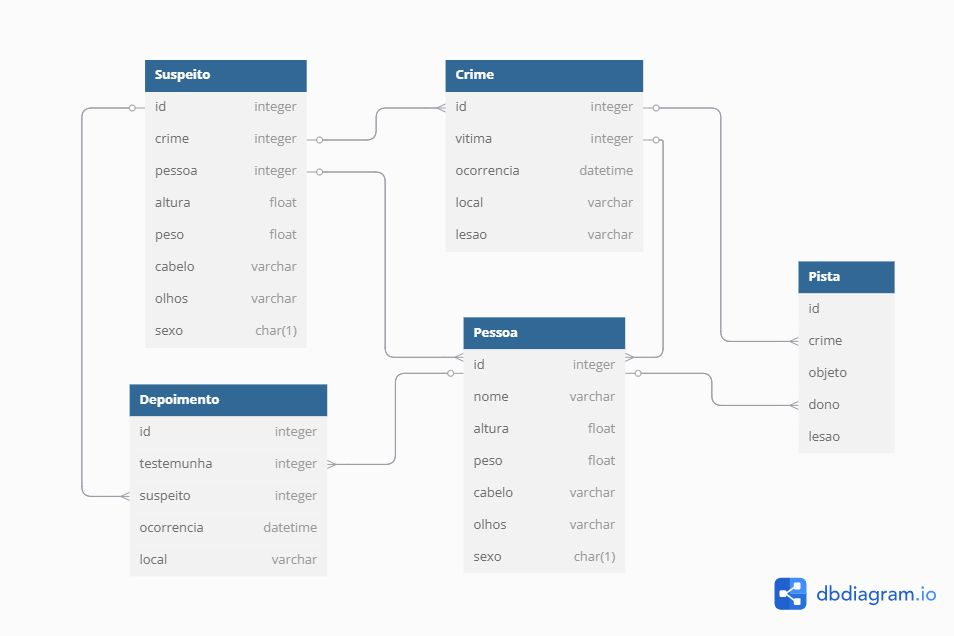

# Jogo de *detetive* no terminal!

## História
O tenente "Dantas Falcão" (nome fictício - qualquer semelhança com a realidade é mera coincidência) trabalha no departamento de homicídios da polícia e está encarregado de resolver casos pendetes - Para isso, ele precisa rever os depoimentos, analisar as pistas e idenficcar os suspeitos.

## Funcionamento
O jogo funciona através de opções no terminal (DOS, Bash...) que o jogador vai digitando e vendo o resultado de cada query no banco de dados.
> ❌Ainda não existe uma opção para resolver o caso >> **Em construção**

## O objetivo deste jogo é:
* Treinar análise de dados;
* Exercitar a lógica ao eliminar pistas falsas;
* Gameficar o aprendizado de SQL;
* Observar diferentes tipos de queries em cada situação.

Tabelas
---
Diagrama de dados:

> Obs.: a tabela `Pista` foi renomeada para **Objeto** e o campo objeto agora se chama "tipo"

> As tabelas são arquivos .parquet fornecidos junto com o jogo.

### ATENÇÃO: É possível gerar novos casos com personagens diferentes usando `python cria_dados.py` ⚠️

---
#### por Júlio Cascalles.©️